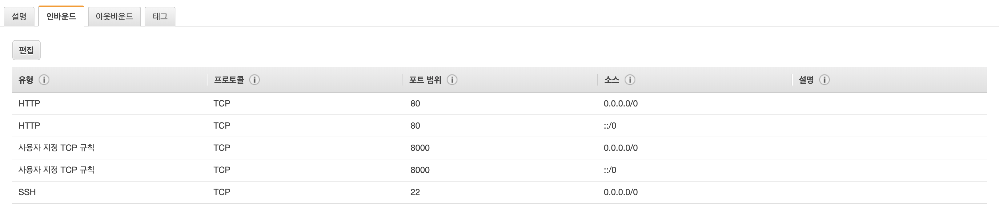

## 초기 환경설정
```bash
$ sudo apt-get update && sudo apt-get upgrade -y
```

## python 환경설정
```bash
$ sudo apt-get install python3-venv     # 가상환경 생성 라이브러리 설치
$ python3 -m venv env                   # 가상환경 생성
$ source env/bin/activate               # 가상환경 실행
```

## gunicorn & nginx 설치
django 서버는 `runserver` 명령어를 통해 구동할 수 있지만 운영서버에서는 성능이나 안정성 이슈로 인해 다른 방식으로 서버를 구동시켜야 한다.
이를 관리해 주는 툴이 `gunicorn`과 `nginx`이다.
```bash
$ pip3 install gunicorn
$ sudo apt-get install -y nginx
$ sudo nginx
nginx: [emerg] bind() to 0.0.0.0:80 failed (98: Address already in use)
nginx: [emerg] bind() to [::]:80 failed (98: Address already in use)
nginx: [emerg] bind() to 0.0.0.0:80 failed (98: Address already in use)
nginx: [emerg] bind() to [::]:80 failed (98: Address already in use)
nginx: [emerg] bind() to 0.0.0.0:80 failed (98: Address already in use)
nginx: [emerg] bind() to [::]:80 failed (98: Address already in use)
nginx: [emerg] bind() to 0.0.0.0:80 failed (98: Address already in use)
nginx: [emerg] bind() to [::]:80 failed (98: Address already in use)
nginx: [emerg] bind() to 0.0.0.0:80 failed (98: Address already in use)
nginx: [emerg] bind() to [::]:80 failed (98: Address already in use)
nginx: [emerg] still could not bind()
```
nginx가 정상적으로 설치되었다면 nginx를 실행했을때 위와 같은 콘솔이 뜬다.

## nginx 구동 테스트
django 프로젝트의 프로젝트앱에서 아래 명령어를 통해 gunicorn을 구동시켜 nginx가 정상적으로 동작하는지 확인한다.
```bash
$ gunicorn --bind 0.0.0.0:8000 <django 프로젝트 앱 이름>.wsgi:application
```
위 명령어를 통해 서버를 수동으로 실행시킨 후 해당 EC2 서버의 퍼블릭 도메인 8000번 포트로 접속한다. 이때 접속이 되지 않는다면 AWS 콘솔에서 
"네트워크 및 보안 > 보안그룹" 태그에 들어가 인바운드 유형을 확인한다.
단순히 개발용 및 HTTP통신만 사용한다면 아래와 같이 포트를 열어주면 된다.



## django 서버 자동으로 실행하기
위 작업을 통해 nginx가 정상적으로 배포된 것을 확인했다면 이 작업을 백그라운드에서 자동으로 돌아가게 하는게 좋을것이다. 아래 명령어를 통해 백그라운드로 작업을 대신 해주는 툴인 `supervisor`를 설치하고, 서버가 구동하게끔 설정해준다.
```bash
$ sudo apt-get install -y supervisor
$ cd /etc/supervisor/conf.d
$ sudo touch gunicorn.conf
```

위 명령어를 통해 `gunicorn.conf` 파일을 생성하고 아래 코드를 작성한다.

```
[program:gunicorn]
directory=/home/ubuntu/<django 프로젝트 이름>
command=/home/ubuntu/venv/bin/gunicorn --workers 3 --bind unix:/home/ubuntu/<django 프로젝트 이름>/app.sock <django 프로젝트앱 이름>.wsgi:application
autostart=true
autorestart=true
stderr_logfile=/var/log/gunicorn/gunicorn.err.log
stdout_logfile=/var/log/gunicorn/gunicorn.out.log

[group:guni]
programs:gunicorn
```

작성을 완료했으면 위 설정을 `supervisor`에게 알려준 후 백그라운드로 위 작업이 돌아가게 한다.

```bash
$ sudo supervisorctl reread
$ sudo supervisorctl update
$ sudo supervisorctl status
guni:gunicorn                    RUNNING   pid 27472, uptime 0:0:3
```

다음은 nginx 설정 파일에 wsgi로 실행한 앱 정보를 입력한다.
```bash
$ cd /etc/nginx/sites-available/
$ sudo touch django.conf
```
```
server {
    listen 80;

    server_name 13.xxx.xxx.xxx ec2-13-xxx-xxx-xxx.ap-northeast-2.compute.amazonaws.com;

    location / {
        include proxy_params;
        proxy_pass http://unix:/home/ubuntu/<django 프로젝트명>/app.sock;
    }
}
```
listen 포트는 http 기본 포트인 80로 설정한다. 이제 80번 포트가 wsgi에서 시작하는 app에 연결되며, server_name은 django의 ALLOWED_HOSTS와 같이 입력한다. 다음은 설정 파일의 링크를 `sites-enabled`에 생성한다.
```bash
$ sudo ln django.conf /etc/nginx/sites-enabled/
$ sudo nginx -t         # nginx 동작 확인
$ sudo service nginx reload
$ sudo service nginx restart
```

위 작업까지 진행했다면 django 프로젝트는 정상적으로 배포 되었다. 이제 브라우저의 주소창에 AWS 퍼블릭 DNS 또는 IP를 입력하면 여러분들의 서버가 정상적으로 동작하는 것을 확인할 수 있다.


## 유지보수
만약 django의 코드를 수정하여 EC2 서버에 수정 내용을 반영하고 싶다면 아래 명령어를 통해 최신화 한다.
```bash
$ sudo service nginx reload
$ sudo service nginx restart
```

django 서버가 아무 이유 없이 동작하지 않는다거나 특별한 이유 없이 에러가 나게 되면 백그라운에서 돌아가는 `gunicorn`을 재실행 시켜준다.
```bash
$ sudo supervisorctl stop all
$ sudo supervisorctl start all
$ sudo supervisorctl status
$ sudo service nginx restart
```