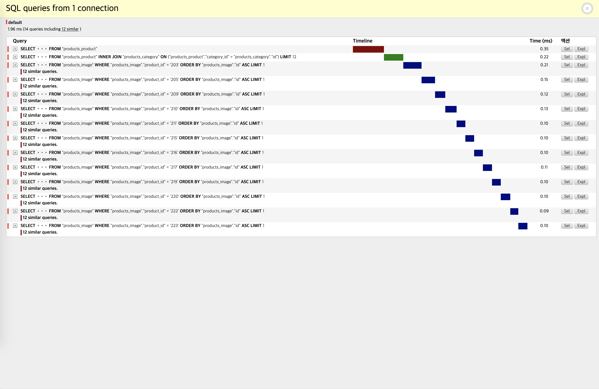

# 불필요한 쿼리를 줄이자


Python의 프레임워크중 하나인 Django는 **ORM(Object Relational Mapping)**을 지원합니다. 우리는 ORM을 통해 SQL을 알지 못해도 데이터 베이스에서 데이터를 손쉽게 조회하고 수정, 삭제, 생성 등의 작업을 할 수 있습니다. 이렇게 DB에서 가져온 데이터를 Python의 data structure인 **Queryset**으로 변경시켜 사용자에서 보여줄 수 있습니다.

SQL을 모르는 개발자도 ORM을 사용해 쉽게 DB를 컨트롤할 수 있다는 것은 정말 큰 장점이지만 실제 서비스에서는 신중하게 사용할 필요가 있습니다. 겉으로 보기에는 정상적으로 돌아가는 코드처럼 보이지만 단순한 ORM만 사용하게 되면 반복적인 쿼리로 인해 심각한 경우 서버가 다운될 수도 있기 때문입니다. 

ORM을 사용하며 DB 컨트롤의 신세계(?)를 맛보신 개발자분들에게는 아쉽지만 절대로 ORM을 맹신해서는 안됩니다. SQL을 Python 코드로 짤 수 있다는 장점 뒤에는 때때로 성능을 포기한다는 단점이 숨어있기 때문입니다. 

실제로 저는 이번 토이프로젝트를 진행하며 ORM의 한계를 인지하게 되었고, 이때 알게되었던 ORM의 기능에 대해 적어보려고 합니다.

먼저 이번 예시에서 사용할 모델은 다음과 같습니다.

```python
# models.py
class Category(base_models.TimeStampedModel):
  	"""
    상품의 카테고리를 정의
    """
    name: str = models.CharField(
        "카테고리명", db_index=True, null=False, unique=True, max_length=30
    )
      

class Product(base_models.TimeStampedModel):
    """
    모든 상품에 공통적으로 필요한 필드들을 정의
    """
    user: user_models.User = models.ForeignKey(
        user_models.User,
        on_delete=models.CASCADE,
        related_name="products",
        null=False,
        verbose_name="유저",
    )
    category: Category = models.ForeignKey(
        Category,
        on_delete=models.SET(set_FK_model_category),
        related_name="products",
        null=False,
        verbose_name="카테고리",
    )
    title: str = models.CharField("제목", max_length=120, null=False)
    price: int = models.PositiveIntegerField(
        "가격(원)",
        null=False,
        default=0,
        validators=[MinValueValidator(0), MaxValueValidator(100000000)],
    )
    describe: str = models.TextField("설명", null=False)
      

class Image(base_models.TimeStampedModel):
    """
    상품에 등록될 사진들을 저장하는 테이블
    """
    image = models.ImageField(
        "사진", upload_to="product_images/", default="default.png", null=False
    )
    product: Product = models.ForeignKey(
        Product,
        on_delete=models.CASCADE,
        related_name="images",
        null=False,
        verbose_name="상품",
    )
```


위에서 정의한대로 `Product` 테이블에 상품들의 정보가 저장되며 `Caegory` 테이블과 1:N 관계를 갖습니다. 그리고 각각의 상품에는 이미지가 저장되기 때문에 `Product` 테이블과 `Image` 테이블은 1:N 관계를 갖습니다.


#### 수정 전

저는 위 처럼 정의된 모델에서 데이터를 불러와 template에 뿌려주고자 아래와 같이 코드를 작성했습니다.

```python
# views.py
def get_queryset(self):
    queryset = models.Product.objects.all()
    return queryset
```

```html
<ul class="list-products row">
  <!-- products가 12개라고 가정 -->
  
  <li class="list-products-item col-12 col-md-4 col-lg-3">
    <a href="">
      <div class="card">
        <div class="card-img-top"
             style="background: url('{{ product.images.first.image.url }}') no-repeat center; background-size: cover; height: 240px">
          <!-- product 인스턴스 별로 1:N 관계인 Image 모델에 접근  -->
          <!-- products가 총 12개 이므로 12번 Image 모델에 접근한다. -->
        </div>
        <div class="card-body">
          <h5 class="title">{{ product.title|truncatewords:2 }}</h5>
          <h6 class="price">{{ product.price|intcomma }}원</h6>
          <div class="text-muted">
            <h6 class="category">{{ product.category.name }}</h6>
            <!-- product 인스턴스와 N:1 관계인 Catgory 모델에 접근 -->
            <!-- 다시한번 각 product별로 Category 모델에 12번씩 접근한다. -->
          </div>
        </div>
      </div>
    </a>
  </li>
  
</ul>
```

위와 같이 가장 기본적인 ORM 코드를  `views.py` 에 작성해 쿼리를 요청하면 아래와 같은 현상이 발생합니다.


단순히 `Product.objects.all()`을 사용해 상품을 조회하면 **총 4.23 ms가 소요되고 26개의 쿼리**를 생성하며 24개가 유사한 쿼리이고 그 중 12개는 중복된 쿼리를 생성합니다. 항상 정상적으로 데이터가 넘어오는것만 확인을 해 프로젝트를 진행한 저는 충격을 받았습니다. 너무나 쉽게 사용한 ORM이 뒤에서는 이렇게 비효율적으로 작동한다는 것을 처음알았습니다. 

약간의 구글링을 통해 `select_related` 와 `prefetch_related` 에 대해 알게 되었고, 두 메소드를 사용해 불필요한 쿼리를 줄일 수 있었습니다.


### Queryset 수정 및 성능 개선 과정

#### 수정 1

```python
# views.py
def get_queryset(self):
    # queryset = models.Product.objects.all()
    queryset = models.Product.objects.select_related("category").all()
    return queryset
```



단순히 queryset을 생성하는 코드 한 줄 바꿨을 뿐인데 **26개의 쿼리가 14개로 줄고 1.93 ms로 줄어들었습니다!** 

`select_related` 를 사용하면 **foreign-key, OneToOneField** 관계인 테이블을 한번에 캐싱되기 때문에 재사용할 경우 추가적인 쿼리가 발생하지 않습니다. 


#### 수정 2

```python
# views.py
def get_queryset(self):
    # queryset = models.Product.objects.all()
    # queryset = models.Product.objects.select_related("category").all()
    queryset = (
        models.Product.objects.prefetch_related(
            Prefetch("images", queryset=models.Image.objects.all(), to_attr="image")
        )
        .select_related("category")
        .all()
    )
    return queryset
```

```html
<ul class="list-products row">
  <!-- products가 12개라고 가정 -->
  
  <li class="list-products-item col-12 col-md-4 col-lg-3">
    <a href="">
      <div class="card">
        <div class="card-img-top"
             style="background: url('{{ product.image.0.image.url }}') no-repeat center; background-size: cover; height: 240px">
          <!-- 새롭게 정의한 image라는 변수로 Image 테이블에 접근 -->
        </div>
        <div class="card-body">
          <h5 class="title">{{ product.title|truncatewords:2 }}</h5>
          <h6 class="price">{{ product.price|intcomma }}원</h6>
          <div class="text-muted">
            <h6 class="category">{{ product.category.name }}</h6>
          </div>
        </div>
      </div>
    </a>
  </li>
  
</ul>
```


이번에는 `Product`와 1:N 관계인 `Image` 테이블과 `prefetch_related` 를 적용했습니다. 결과적으로 **단 3개의 쿼리와 0.83 ms**만에 동일한 결과를 낼 수 있었습니다.


### 마무리

많은 개발자들이 ORM을 사용할 때 너무 당연하게 `.objects.all()` 을 사용합니다. 저 또한 이제서야 이러한 이슈에 대해 알게되었습니다. Python이라는 언어의 특징상 코드를 작성하는 개발자도 알지 못하는 곳에서 자동으로 해 주는것이 너무나도 많은데 이는 Python의 가장 큰 장점이자 단점인 것 같습니다. 

이번 기회를 통해 SQL 학습을 다시 시작하게 되었고 queryset이 어떻게 저장되는지 알게 되었습니다. 추후 포스트에서는 전반적인 Queryset에 대한 이해와 `select_realted`, `prefetch_realted` 원리에 대해 알아보도록 하겠습니다.